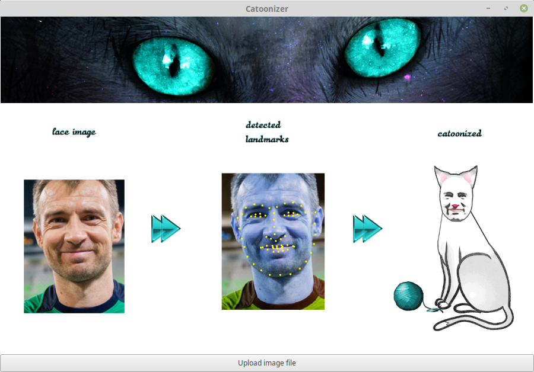

# Catoonizer

## Project informations

Catoonizer is an application that is being developed as an individual project within the course Machine Learning on the Faculty of Mathematics, University of Belgrade. The idea was to transform frontal human face image to cartoonized cat version, using machine learning techiques to detect some face parts of interest for further image edition.

 

## Realization

First phase of realization was creating a model for detection of 68 key facial landmarks. Model is constructed of two convolutional neural networks with specific structure based on combination of approaches used in papers [A Fully End-to-End Cascaded CNN for Facial Landmark Detection](http://vipl.ict.ac.cn/uploadfile/upload/2017122111490412.pdf) and [Facial Landmarks Detection by Self-Iterative Regression Based Landmarks-Attention Network](https://arxiv.org/abs/1803.06598). 

Second phase was using coordinates of detected points and writing [GIMP](https://www.gimp.org/) Python scripts for transforming image to final output.

 

## Data sets

Data sets used for neural networks training are available on https://ibug.doc.ic.ac.uk/resources/facial-point-annotations/.

 

## Screenshots

### Example 1

 
 

### Example 2

 
 

### Example 3

 
 

### Example 4

